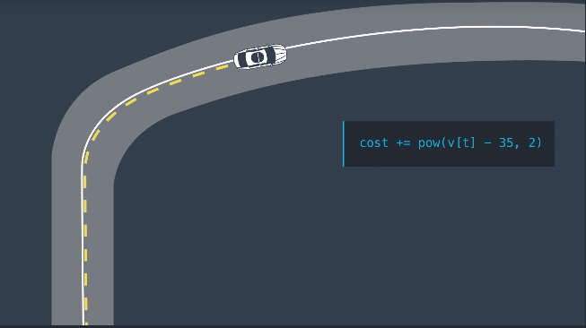
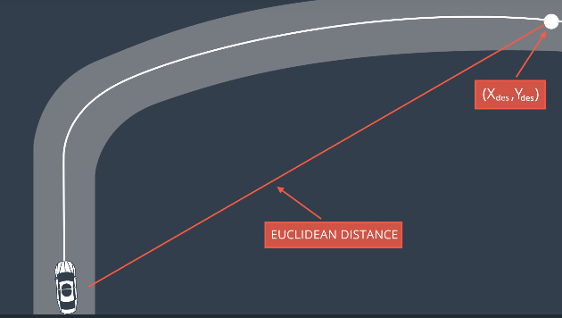
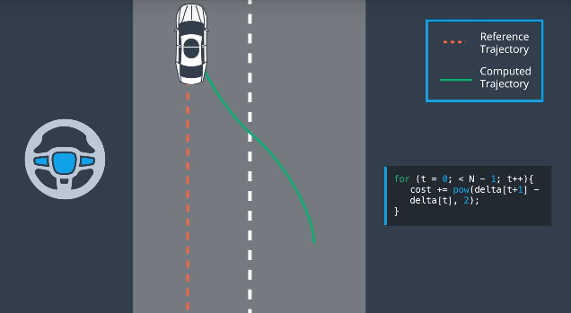
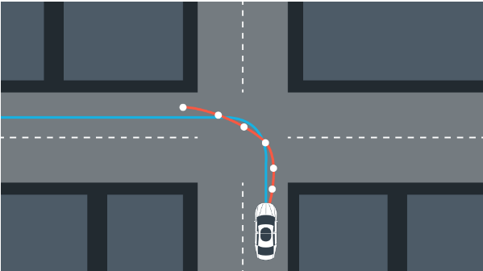
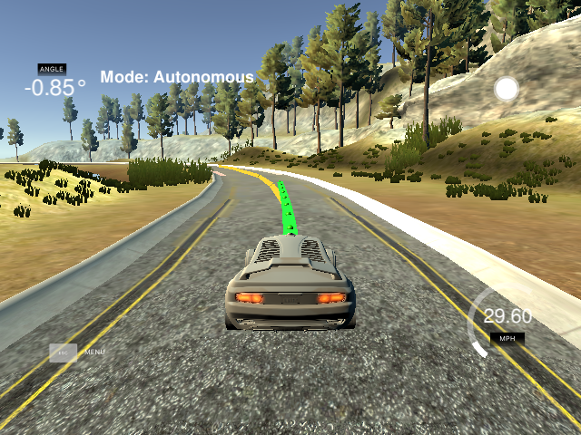

# Project 5 - Model Predictive Controllers (MPC)

## 0. Basic Build Instructions

1. Clone this repo.
2. Make a build directory: `mkdir build && cd build`
3. Compile: `cmake .. && make`
4. Run it: `./mpc`.

## 1. Transforming Waypoints
The desired trajectory around the track is represented in terms of the global coordinate
system and must be converted to the vehicle coordinates to display the waypoint markers.
Subtracting the vehicle position from the waypoint position and adjusting for the angle
of the vehicle with respect to the map (psi) the way points can be passed back to the 
simulator to be displayed.

    $  x_point =  cos(psi) * (x_glob - x_car) + sin(psi) * (y_glob - y_car);
    $  y_point = -sin(psi) * (x_glob - x_car) + cos(psi) * (y_glob - y_car);

Where:
- `psi`: angle of the car in the global frame (radians)
- `x_car`: x position of car in global frame
- `y_car`: y position of car in global frame
- `x_glob`: x position of waypoint in global frame
- `y_glob`: y position of waypoint in global frame

## 2. Polynomial Fit
The `Eigen::vectorXd polyfit()` function accepts x and y coordinate vectors as
input and returns the coefficients of the polynomial that best fits the trajectory.
This project used an order of three for the polynomial to get the closest matching 
trajectory while accounting for S-bends in the track.

## 3. Model Predictive Controller (MPC)
The MPC is the backbone of this project and relies on the IpOpt libraries for
optimizing the trajectory of the car with respect to the waypoints around the track
and the current vehicle speed.

### 3.1 Reference State
With the polynomial coefficients calculated from the waypoints we can calculate the
CTE and EPSI values for the state vector required by the MPC. Since x is inline with
the vehicles direction of travel, we can determine the cross track error of the car
by setting x=0 and plugging it into the polynomial to solve for y. Additionally,
the rate of change comes from calculating the arctan of the second polynomial
coefficient. Since the state is in reference to the car coordinate frame the x, y,
and psi values will always be zero (state ==> {x,y,psi,v,cte,epsi}).

    $  Eigen:VectorXd state = {0, 0, 0, v, cte, epsi}

### 3.2 Cost Functions
How we chose to weight the cost function determines how the system will respond. From
the course material several cost considerations were considered to improve the overall
performance of the car around the track.

#### 3.2.1 Reference Velocity
Penalizing the car for not maintaining the reference velocity (v_ref) is a method for 
preventing the car from coming to a complete stop if it is unable to maintain the 
center line of the road (large CTE). The larger the reference velocity, the faster
the car will try to drive around the track.

    $  cost += pow(v[t] - v_ref, 2)

 

#### 3.2.2 Euclidean Distance
The further the absolute distance of the car with respect to the first waypoint
(ignoring the angle of the car, psi) the larger the penalty added to the cost
function. This aims to prevent the car from veering off from the center of the road.

    $  d_x = pow(x_point - x_car, 2)
    $  d_y = pow(y_point - y_car, 2)
    $  cost += (d_x + d_y)

 

#### 3.2.3 Actuator Response
Penalizing large actuation requests such as would be seen by the steering request
if the car was far from the center line results in smoother transitions between
states and ultimately result in a less jerky ride.

    $  for (int t = 0; t < N-1; t++) {
    $    cost += pow(delta[t+1] - delta[t], 2)
    $    cost += pow(a[t+1] - a[t], 2)
    $  }

 

### 3.3 Length & Duration
The prediction horizon is the extent into the future the trajectory of the car is
calculated and is set by the size of the timestep (dt) and number of iterations (N)
to carry out. The trade of is between time and accuracy since a small timestep with
a large number of iterations would produce a smooth estimate of the path but would
require more computations while the trade off is not enough data to make an accurate
prediction from. Since I am running this a generic off the shelf laptop (not an Alien
PC powerhouse), I kept computations small to prevent hanging on calculations. Final 
values were N = 12 and dt = 0.05 since this provided enough of a look ahead at high speeds
to handle the corners and anything higher than these resulting in lagging and jumping of
waypoints (yellow) on the track.

 

### 3.4 Latency
In the real world there is a delay between a requesting a command and the resulting
action which is known as latency. For this project we have settled on a latency of
100ms to simulator how a car would actually respond; for instance an actuator 
moving a steering wheel or a pedal cannot happen instantaneously due to physics. To
account for this latency we have to slow the rate of response of our actuators so that
they do not over correct. Rather, we want an over damped system response to prevent
the passengers from getting seasick.

### 3.5 Tuning the MPC
Now that the MPC is implemented and the car is able to drive (slowly) around the
track, the cost functions can be tuned by applying a weighting factor (>1) to
each of the values being added to adjust which factors are more influential in the
optimization calculations. The results of weighting each cost function can be
assessed by plotting the steering angle and cross track errors for the beginning
section of the track.

A weighting variable was added to each of the cost functions discussed and initially set to 1.0. Similiar to 
the Twiddle function used in the PID Controller project, these values were adjusted by increasing or decreasing
their values (> 0.0) in response to the overall system error and stability. The cost functions that were the
most sensitive resulted in higher weighting factors while those that did not have much affect were left at the
default values. After tuning, the most influential cost factors were those that penalized initial system error,
large rates of change, and large actuation requests. This basically resulted in an overdamped system since the
car can be seen understeering on tight corners.

## 4. Displaying Trajectories
With the map waypoints converted to the car coordinate frame and the optimized trajectory
from the MPC, these vectors are passed to the simulator as a JSON through port 4567. The
course waypoints are displayed in yellow and the predicted vehicle trajectory is
displayed in green.

 

## 5. Running the Simulator

 

