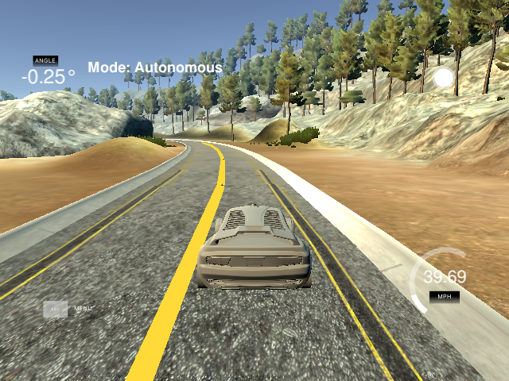

# CarND-Controls-MPC
Self-Driving Car Engineer Nanodegree Program

## 0. Basic Build Instructions

1. Clone this repo.
2. Make a build directory: `mkdir build && cd build`
3. Compile: `cmake .. && make`
4. Run it: `./mpc`.

## 1. Reading the Simulator

### 1.1 Display Path
The desired trajectory around the track is represented in terms of the global coordinate system and must be converted to the vehicle coordinates to display the waypoint markers. Subtracting the vehicle position from the waypoint position and adjusting for the angle of the vehicle with respect to the map (psi) the way points can be passed back to the simulator to be displayed.

 

### 1.2 Assembling the Parameters?
...

## 2. Model Predictive Controller
The MPC aims to fits polynomial to the desired path that minimizes the overall cross track error (CTE) of the vehicle from the center of the lane. The actuation command to the first waypoint in the MPC path becomes the input to the vehicle.

### 2.1 Controller Setup

- define duration of trajectory (T) calculated from dt and N.
- define vehicle model
- define constraints (throttle & steering)
- define cost function

### 2.2 State Feedback Loop

- pass current state to MPC
- optimization solver is called (ipopt)
- repeat the loop

- measure the Euclidean distance between the vehicle and the next waypoint (in positive space)
- add this distance to the cost function
- set a reference velocity ( cost += pow(v[t] - 35, 2) )

## 3. Tuning the Simulator
...

## 4. Running the Simulator
...

 

